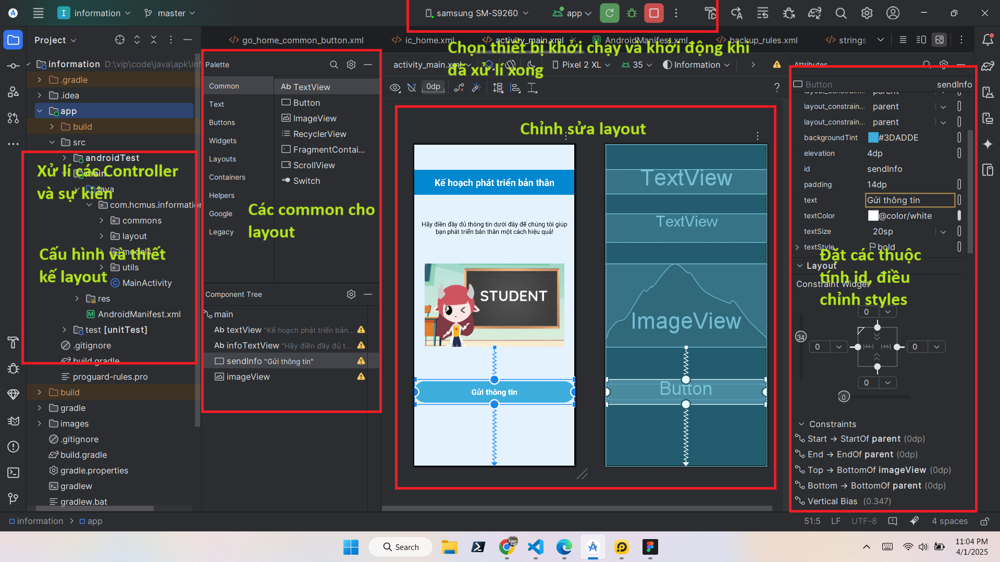
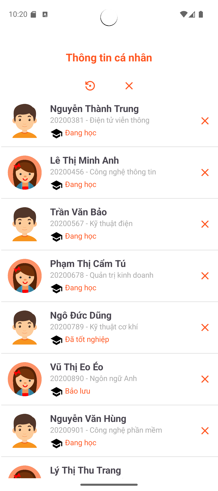
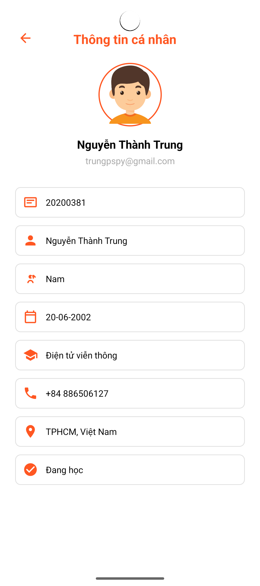
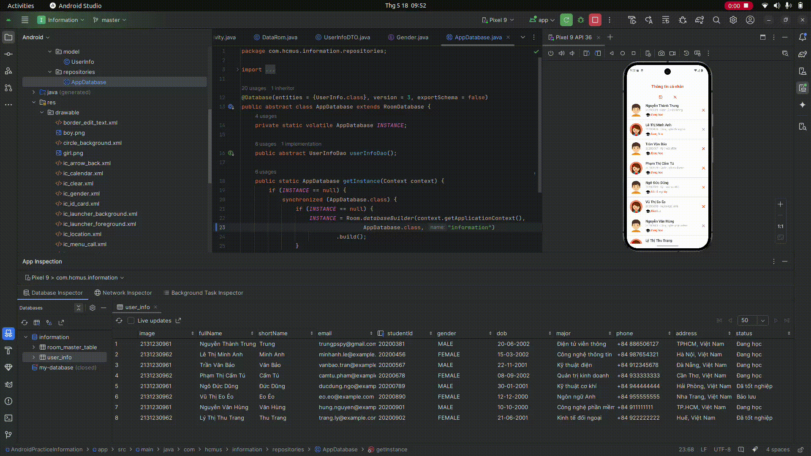

# Information Android App

This is an Android application for managing and displaying student information using Room Database.

---
## 🎬 Application Demo & Testing

---

##  🎬 Watch on Youtube

---

## 🚀 1. Create a New Project in Android Studio
Create a new project in **Android Studio**:

---

## 🏗️ 2. Choose Activity Type
Select **Basic View Activity** for a simple interface:

---

## ✏️ 3. Name the Project and Select Android Configuration
Enter the app name, package name, and choose **Java/Kotlin** as the language:

---

## 🖥️ 4. Main Screen in Android Studio
When you open the project, you'll see the main interface including **XML Layouts** and **MainActivity**:

---
## 🎨 5. UI Design (Layout)

### 🔹 Main Activity
The main screen introduces the application and displays integrated features.  

### 🔹 Detail Activity (Show Information)
When you click on a student in the ListView on the main screen, a new screen appears showing detailed information about the selected student.  

---
## Features

- List all students with their details (name, student ID, major, status, etc.)
- View detailed information for each student
- Add default student data to the database
- Clear all student data
- Uses Room for local data persistence

## Project Structure

- `app/src/main/java/com/hcmus/information/`
  - `activity/` — Main and Detail activities
  - `adapter/` — Custom adapter for displaying students
  - `dao/` — Room DAO for user info
  - `data/` — Default data provider
  - `dto/` — Data transfer objects
  - `enums/` — Enum for gender
  - `model/` — UserInfo entity
  - `repositories/` — Room database singleton
- `app/src/main/res/layout/` — UI layouts
- `app/src/main/res/drawable/` — Icons and backgrounds
- `app/src/main/res/values/` — Strings, colors, themes, arrays
- `data.sql` — Example SQL inserts for user_info table

## How to Build

1. Open the project in Android Studio.
2. Sync Gradle.
3. Build and run on an emulator or device (minSdk 27, targetSdk 36).

## Dependencies

- AndroidX libraries (AppCompat, ConstraintLayout, Activity)
- Material Components
- Room Database
- Lombok (for DTO/model boilerplate)

## Database

Uses Room with a single entity: `UserInfo`. Default data is inserted on first launch via [`DataRom`](app/src/main/java/com/hcmus/information/data/DataRom.java).

## Screenshots

## License

This project is licensed under the Apache License 2.0.